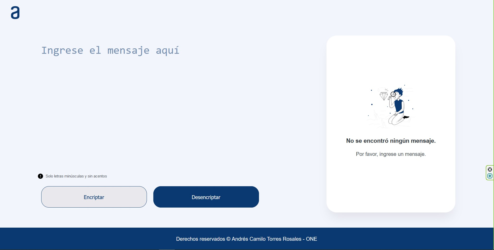

# Challenge ONE Encriptador
## Hecho por Andrés Camilo Torres

**¡Bienvenido al Challenge ONE Encriptador!** Este proyecto fue creado como parte del desafío de programación para poner en práctica las habilidades en desarrollo web.

El Encriptador es una herramienta que te permite encriptar y desencriptar mensajes de texto de forma segura. Utiliza un algoritmo de encriptación avanzado para proteger la confidencialidad de tus mensajes.

### Características principales:

- Encripta y desencripta mensajes de texto.
- Soporta diversos algoritmos de encriptación.
- Interfaz intuitiva y fácil de usar.

### Tecnologías utilizadas:

- HTML
- CSS
- JavaScript

### Instrucciones de uso:

- Ingresa el mensaje de texto en el campo correspondiente.
- Haz clic en el botón "Encriptar" para encriptar el mensaje.
- Si deseas desencriptar el mensaje, haz clic en el botón "Desencriptar".
- Copia el resultado encriptado o desencriptado según sea necesario.
- ¡Listo! Tu mensaje está seguro.

(Recuerda que solo se pueden letras a-z y todas en minúsculas)

### Imagén Encriptador:

